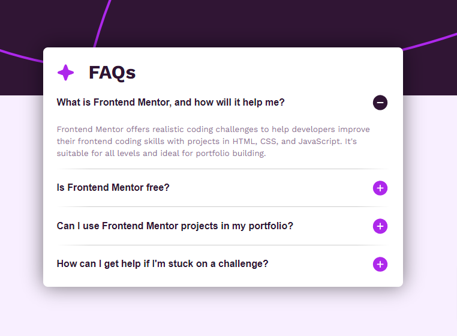

# Frontend Mentor - FAQ accordion solution

This is a solution to the [FAQ accordion challenge on Frontend Mentor](https://www.frontendmentor.io/challenges/faq-accordion-wyfFdeBwBz). Frontend Mentor challenges help you improve your coding skills by building realistic projects. 

## Table of contents

- [Overview](#overview)
  - [The challenge](#the-challenge)
  - [Screenshot](#screenshot)
  - [Links](#links)
- [My process](#my-process)
  - [Built with](#built-with)
  - [What I learned](#what-i-learned)
  - [Continued development](#continued-development)
- [Author](#author)

## Overview

### The challenge

Users should be able to:

- Hide/Show the answer to a question when the question is clicked
- Navigate the questions and hide/show answers using keyboard navigation alone
- View the optimal layout for the interface depending on their device's screen size
- See hover and focus states for all interactive elements on the page

### Screenshot

### Links

- Solution URL: [https://github.com/jotaprojects/faq-accordion](https://github.com/jotaprojects/faq-accordion)
- Live Site URL: [https://jotaprojects.github.io/faq-accordion/](https://jotaprojects.github.io/faq-accordion/)

## My process

### Built with

- Semantic HTML5 markup
- CSS custom properties
- Flexbox
- [Vite](https://vitejs.dev/) - For development
- [Stylelint] - For lint css

### What I learned

The background image was tricky to find a good solution. I research on other sites how they did in a simliar setup. Some used a div and add the image as a background-image, other used the image direct with the img-tag. 
My conclusion is that you can solve this in many different ways. 
I chose an extra div with background-image property. I did try out to set the background to `body` but then I got a problem when I used the min-height: 100vh so that is why I changed to an extra div. 

- Left to do is to read up on accessibility for the accordion. 

**Note:** Vite seems to only build and copy the javascript file when using `type="module"` on the script-tag itself. Good to know for future projects. 

### Continued development

- Continue investigating Vite together with css processors (SCSS). 
- Try to use grid instead of flexbox in future projects. 

## Author

- Website - [jotaprojects](https://jotaprojects.se)
- Frontend Mentor - [@jotaprojects](https://www.frontendmentor.io/profile/jotaprojects)
